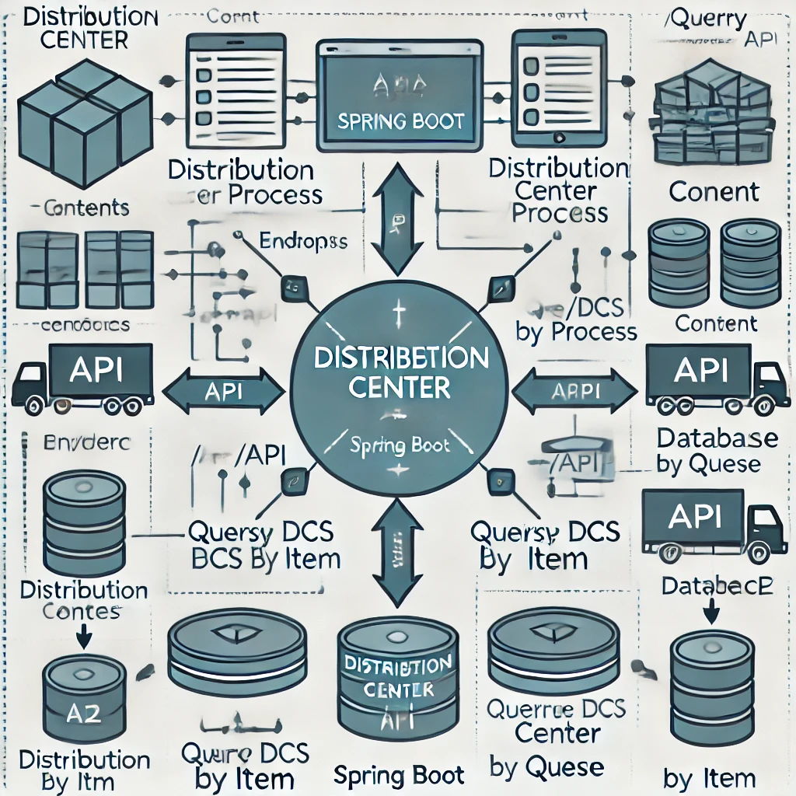

# API Центров Распределения


Этот проект представляет собой бэкенд API на Java, разработанный с использованием **Spring Boot**, **Maven**, **База данных H2**, **Lombok** и включает юнит-тесты. Цель API — обрабатывать заказы и определять, какой центр распределения (ЦР) должен быть использован для отправки каждого товара на основе информации, предоставленной API центров распределения.

## Цель

Разработать решение, которое обрабатывает заказы и определяет, какой центр распределения (ЦР) следует использовать для отправки каждого товара, основываясь на информации, предоставленной API центров распределения.

## Функциональные требования

- **Один заказ может содержать до 100 товаров.**
- **API для обработки заказов**: API должно быть способно обрабатывать заказ и возвращать центры распределения (ЦР), связанные с каждым товаром.
- **API для запроса заказов**: API должно позволять запрашивать заказы, возвращая товары и их соответствующие центры распределения.
- **Интеграция с API "Поиск ЦР по товару"**: API должно использовать внешний API для запроса и помощи в определении идеального ЦР для отправки товара.

## Используемые технологии

- **Java 17+**: Используемый язык программирования.
- **Spring Boot**: Основной фреймворк для построения API.
- **Maven**: Менеджер зависимостей и инструмент сборки.
- **H2 Database**: Реляционная база данных в памяти, используемая для хранения информации о заказах и центрах распределения.
- **Lombok**: Библиотека для сокращения шаблонного кода, такого как геттеры, сеттеры и конструкторы.
- **JPA (Java Persistence API)**: Используется для объектно-реляционного отображения и взаимодействия с базой данных.
- **JUnit / Mockito**: Инструменты для юнит-тестирования.

## Эндпоинты

### 1. Обработать заказ
**POST** `/api/order/process`

**Описание**: Обрабатывает заказ и определяет центры распределения (ЦР), связанные с каждым товаром.

**Тело запроса**:
```json
{
  "orderId": "12345",
  "items": [
    { "itemId": "abc", "quantity": 2 },
    { "itemId": "def", "quantity": 1 }
  ]
}
```

# Distribution Center API

This project is a backend API in Java, developed with **Spring Boot**, **Maven**, **H2 Database**, **Lombok**, and includes unit tests. The goal of the API is to process orders and determine which distribution center (DC) should be used for shipping each item, based on the information provided by the distribution center API.

## Objective

Develop a solution that processes orders and determines which distribution center (DC) should be used for shipping each item, based on the information provided by the distribution center API.

## Functional Requirements

- **An order can have up to 100 items.**
- **API to Process Orders**: The API must be capable of processing an order and returning the distribution centers (DCs) associated with each item.
- **API to Query Orders**: The API must allow querying orders, returning the items and their associated distribution centers.
- **Integration with "Query DCs by Item" API**: The API must use an external API to query and assist in determining the ideal DC for shipping an item.

## Technologies Used

- **Java 17+**: Programming language used.
- **Spring Boot**: Main framework for building the API.
- **Maven**: Dependency management and build tool.
- **H2 Database**: In-memory relational database used to store order and distribution center information.
- **Lombok**: Library to reduce boilerplate code, such as getters, setters, and constructors.
- **JPA (Java Persistence API)**: Used for object-relational mapping and database interaction.
- **JUnit / Mockito**: Tools for unit testing.

## Endpoints

### 1. Process Order
**POST** `/api/order/process`

**Description**: Processes an order and determines the distribution centers (DCs) associated with each item.

**Request Body**:
```json
{
  "orderId": "12345",
  "items": [
    { "itemId": "abc", "quantity": 2 },
    { "itemId": "def", "quantity": 1 }
  ]
}
```